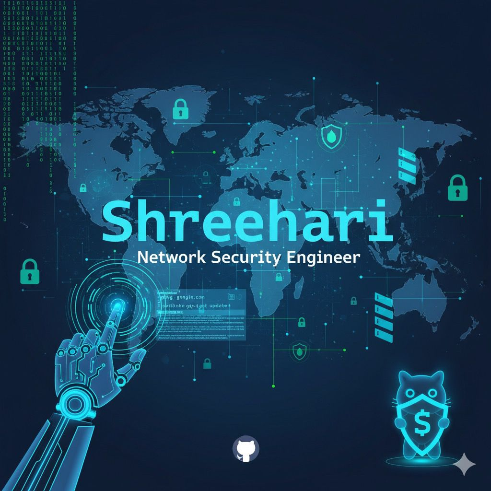

<!-- CODE IT ⚡ — Shreehari | Network Security Engineer | AI & Cybersecurity-->

  

<h1 align="center">
  
  Hi, I'm Shreehari ⚡
</h1>

  

---

## 🚀 One-liner
`nmap --scan Shreehari-network && echo "Host reachable - Initializing Secure AI Stack..."`

---

## 🧑🏻‍💼 About me
- 🎓 B.Tech. — Information Technology (Vellore Institute of Technology, Vellore)  
- 💼 Network Security Engineer with hands-on CCNA | CCNP | CCIE skills  
- 🔐 Expertise: VPN (IPSec/SSL), Next-Gen Firewall (Palo Alto / FortiGate), SD-WAN, NOC operations, Automation using Ansible, Netmiko  
- ⚙️ Interests: AI-driven cybersecurity, threat detection, SASE, Zero Trust architecture

---

## 🧰 Tech Stack & Tools

  
  
  
  
  
  
  
  
  

---
## 📓 Networking Knowledge
**1. Foundational Mastery (The Core)**
Expertise in Layer 2 stability (RSTP/MSTP optimization, advanced switch security like DAI/IP Source Guard) and Layer 3 services (HSRP/VRRP, advanced NAT/PAT). Absolute mastery of IPv4/IPv6 dual-stack implementation and troubleshooting.

**2. Advanced Routing (The Brain)**
Deep, policy-level control over routing protocols.
- **OSPF/EIGRP:** Complex area designs, graceful shutdown, and route filtering/summarization.
- **BGP:** Path attribute manipulation via extensive use of Route Maps, Communities, and Prefix-Lists. Must master Route Reflectors and MP-BGP for VPNs.
- **Redistribution:** Safe and controlled redistribution across different protocols with loop prevention.

 **3. Modern Transport & SDN (The Architecture)**
Focus on large-scale, automated infrastructure.
- **MPLS & Segment Routing:** Implementing and optimizing L3VPNs and Traffic Engineering solutions.
- **SD-Access/SD-WAN:** Expertise in Cisco DNA Center/vManage controller architectures. Deploying advanced micro-segmentation (e.g., Security Group Tags).

 **4. Security & Automation (The Future)**
Integrating protection and efficiency into the network lifecycle.
- **Security:** Device hardening, AAA/802.1X, Control Plane Policing (CoPP), and implementing next-gen firewalls (FTD/ASA) and ISE (Identity Services Engine).
- **Automation:** Using Python, Ansible, and YANG/RESTCONF to deploy, operate, and optimize network infrastructure programmatically.
- **Optimization:** QoS (classification, marking, shaping) and high-availability/fast convergence mechanisms.
 

---
## 🎓 Certification

- 📜 NH Cisco Certified Network Associate (CCNA)
- 📜 NH Cisco Certified Network Professional (CCNP)
- 🎯 Next Goal: Cisco Certified Internetwork Expert (CCIE Security)
---

## 🔗 Connect

  
  
  

